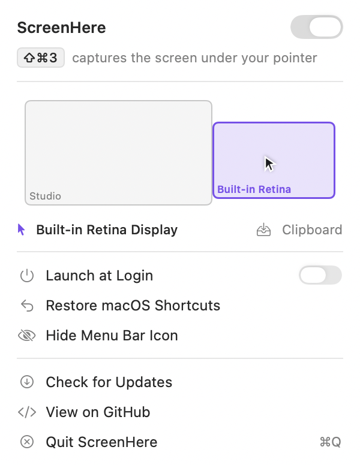

<div align="center">


# ScreenHere

**<kbd>⇧</kbd><kbd>⌘</kbd><kbd>3</kbd> captures the screen you're actually looking at.**
Not the main one. Not both. The one your pointer is on.

[](https://github.com/adrbn/screenhere/releases/latest)

[](https://github.com/adrbn/screenhere/releases/latest)
[](https://www.apple.com/macos/)
[](https://swift.org)
[](Package.swift)
[](LICENSE)

</div>

---

ScreenHere is a tiny, open-source menu-bar utility that fixes one specific, daily annoyance on a multi-display Mac: <kbd>⇧</kbd><kbd>⌘</kbd><kbd>3</kbd> never captures the screen you meant.

There is no new shortcut to learn. ScreenHere borrows the one you already use.

<div align="center">
<br/>
<picture>
  <source media="(prefers-color-scheme: dark)" srcset="docs/assets/panel-dark.png">
  
</picture>
<br/><br/>
</div>

## The problem

<kbd>⇧</kbd><kbd>⌘</kbd><kbd>3</kbd> captures *every* display. When your screenshot destination is the **clipboard**, only one image can fit there — so macOS silently keeps the **main** display and throws the rest away.

If your main display is the external monitor and you're working on the laptop screen, you get the wrong screen. Every single time. The only way out is <kbd>⇧</kbd><kbd>⌘</kbd><kbd>5</kbd>, which makes you click the target display by hand.

| | What <kbd>⇧</kbd><kbd>⌘</kbd><kbd>3</kbd> gives you |
|---|---|
| 🗂️ **Destination: file** | One file per display, and you sort them out afterwards |
| 📋 **Destination: clipboard** | The main display — whether or not you were looking at it |
| ✅ **With ScreenHere** | The display under your pointer, straight to your usual destination |

## The fix

ScreenHere disables the macOS symbolic hotkeys for <kbd>⇧</kbd><kbd>⌘</kbd><kbd>3</kbd> and <kbd>⌃</kbd><kbd>⇧</kbd><kbd>⌘</kbd><kbd>3</kbd>, registers the same two combinations for itself, and on each press works out which display the pointer is on and captures only that one.

- 🎯 **The right screen, every time** — resolved from the live pointer position, recomputed on every press, so hot-plugging a display never confuses it.
- 🗺️ **A live map of your displays** — the menu-bar panel draws your actual arrangement, fills in the display your pointer is on, and tracks the pointer as it moves. You can see what ⇧⌘3 is about to capture before you press it.
- 🪶 **Invisible** — a menu-bar agent with no Dock icon. Hide the menu-bar icon too and it disappears entirely until you reopen the app.
- 🧩 **Nothing else changes** — your destination, folder, file format and shutter sound are macOS's own settings, untouched. Change them in the Screenshot app and ScreenHere follows.
- ↩️ **Always reversible** — one row in the panel hands <kbd>⇧</kbd><kbd>⌘</kbd><kbd>3</kbd> straight back to macOS, and the app restores it on quit, on shutdown, on toggle-off, and even after a crash.
- 🔒 **Private by design** — it never touches your pixels. It resolves a display index and hands the job to Apple's own `screencapture`.
- 🖼️ **The preview lands where you were looking** — optional: ScreenHere can draw the post-capture preview in the corner of the screen it came from, which macOS offers no way to do. Click it to reveal the file, drag it straight into a message. Off by default, because switching it on turns macOS's own preview off — and switching it back restores your setting exactly as it was.
- 🔄 **Updates itself** — signed releases install in place through Sparkle, and the shortcut is handed back to macOS across the relaunch so the swap never leaves a dead key.
- ⚡ **Native Swift**, one dependency (Sparkle), macOS 13 Ventura and later (including macOS 27).

## Install

1. Download `ScreenHere.dmg` from the [latest release](https://github.com/adrbn/screenhere/releases/latest).
2. Open the DMG and drag **ScreenHere** into `/Applications`.
3. Grant Screen Recording so it can capture:
   **System Settings → Privacy & Security → Screen Recording → enable _ScreenHere_.**
   macOS will ask you to quit and reopen the app — that's expected.
4. Say yes when ScreenHere offers to **launch at login**. This one matters: ScreenHere leaves the system shortcut disabled while it holds it, so a Mac that restarts without it running has <kbd>⇧</kbd><kbd>⌘</kbd><kbd>3</kbd> doing nothing at all until you reopen the app. (ScreenHere also hands the shortcut back when your Mac shuts down, so you are never stranded — but launching at login is what keeps it working.)
5. Press <kbd>⇧</kbd><kbd>⌘</kbd><kbd>3</kbd>. Done.

> **Install it in `/Applications`, not somewhere temporary.** The Screen Recording grant is keyed to the app's path as well as its code identity, so an app that moves has to be authorised again.

Builds are signed with Developer ID, so the grant survives updates: you authorise ScreenHere once, not again after every release.

### Hide the menu-bar icon

Open the panel and click **Hide Menu Bar Icon**. The icon vanishes, the app keeps running, and <kbd>⇧</kbd><kbd>⌘</kbd><kbd>3</kbd> keeps working.

To bring it back, **open ScreenHere again** from `/Applications` or Spotlight. That is the documented way back, so it clears the preference outright — the icon stays visible from then on.

## How it works

macOS keeps its keyboard shortcuts in a preferences table called `AppleSymbolicHotKeys`. <kbd>⇧</kbd><kbd>⌘</kbd><kbd>3</kbd> is entry **28**, <kbd>⌃</kbd><kbd>⇧</kbd><kbd>⌘</kbd><kbd>3</kbd> is entry **29**. An app-level hotkey always loses to a system one, so ScreenHere disables those two entries, asks the window server to reload the table, and registers the same combinations through Carbon's `RegisterEventHotKey`.

On each press it reads the pointer's global position, finds the display whose bounds contain it, converts that to the display's index in `CGGetActiveDisplayList`, and runs:

```
/usr/sbin/screencapture -p -D<index>     # ⇧⌘3  — your configured destination
/usr/sbin/screencapture -c -D<index>     # ⌃⇧⌘3 — forced to the clipboard
```

**It deliberately does not capture pixels itself.** Delegating to Apple's binary inherits the destination, folder, format and shutter sound for free — and keeps working when you change those settings later. Reimplementing that with ScreenCaptureKit would be several times the code for a worse imitation.

### Giving the shortcut back

Borrowing a system shortcut means the app owes you an exit. Four independent guards make sure you never end up with a dead <kbd>⇧</kbd><kbd>⌘</kbd><kbd>3</kbd>:

1. **On quit and on shutdown** — `applicationWillTerminate` restores both entries, and a `willPowerOff` observer does the same before the machine goes down, since logout does not reliably reach the former. Same for toggling the app off.
2. **On the next launch** — if a previous run died holding them, ScreenHere restores them before doing anything else, then takes them again cleanly.
3. **From the panel** — **Restore macOS Shortcuts** is always there, whatever state the app is in.
4. **Without the app at all** — if you deleted ScreenHere mid-flight, paste this into Terminal:

   ```bash
   defaults write com.apple.symbolichotkeys AppleSymbolicHotKeys -dict-add 28 '<dict><key>enabled</key><true/><key>value</key><dict><key>type</key><string>standard</string><key>parameters</key><array><integer>51</integer><integer>20</integer><integer>1179648</integer></array></dict></dict>' && /System/Library/PrivateFrameworks/SystemAdministration.framework/Resources/activateSettings -u
   ```

   The same command with `29` and `1441792` restores <kbd>⌃</kbd><kbd>⇧</kbd><kbd>⌘</kbd><kbd>3</kbd>.

When ScreenHere replaces an entry it writes back the **complete** original dictionary with only `enabled` flipped. A naive `-dict-add 28 '{enabled = 0;}'` would drop the `parameters` array, and the shortcut would stay dead even after being re-enabled.

### The capture preview

macOS shows a small preview after a screenshot, and puts it wherever it likes — which on a multi-display Mac is rarely the screen you just captured. There is no setting for that: the preview belongs to macOS's own capture UI, and its placement is not exposed.

So **Preview on Captured Screen** in the panel draws ScreenHere's own instead, in the corner of the display the capture came from. Click it to reveal the file in Finder, drag it out to drop the file into another app, or leave it — it fades after a few seconds.

It covers **every** capture, not only the ones ScreenHere handles: <kbd>⇧</kbd><kbd>⌘</kbd><kbd>4</kbd>, <kbd>⇧</kbd><kbd>⌘</kbd><kbd>5</kbd> and the Screenshot app get a preview too. They have to — switching macOS's preview off switches it off for them as well, and a region capture sent straight to the clipboard would otherwise leave no file, no preview and no sign it had worked.

> With the destination set to the clipboard there is no file to watch, so a capture is recognised by what lands on the pasteboard: a screenshot arrives as bare image data, while an image copied from a web page carries its markup and address along. That is a judgement rather than a certainty, so an image copied some other way may occasionally raise a preview.

> This is the one place ScreenHere changes a macOS setting, and it is the reason the option is off by default. Turning it on remembers your `show-thumbnail` value and disables macOS's preview so you do not get two; turning it off, quitting, or shutting down puts your value back — including the common case where the key was never set at all, which is restored by removing it rather than writing `true`.

## Uninstall

1. Open the panel and click **Restore macOS Shortcuts**. This is the step that matters — it hands <kbd>⇧</kbd><kbd>⌘</kbd><kbd>3</kbd> back to macOS.
2. Quit ScreenHere and drag it from `/Applications` to the Trash.

If you deleted the app without step 1, <kbd>⇧</kbd><kbd>⌘</kbd><kbd>3</kbd> will do nothing at all. The Terminal command under [Giving the shortcut back](#giving-the-shortcut-back) restores it.

ScreenHere stores nothing beyond a few preferences: `defaults delete com.screenhere.app` removes them, including Sparkle's update schedule.

## Build from source

```bash
swift build              # compile
swift test               # run the unit tests
./scripts/install.sh     # build, sign, install into /Applications, relaunch
./scripts/build-dmg.sh   # produce build/ScreenHere.dmg
```

`build-dmg.sh` picks up a **Developer ID Application** identity from the keychain automatically and falls back to ad-hoc signing when none is present. It also embeds `Sparkle.framework` into the bundle, which SwiftPM does not do on its own, and re-signs Sparkle's nested helpers before sealing the app — they ship with their own signature, which Apple rejects at notarization and which stops Sparkle from launching its own installer.

> Ad-hoc signing is a trap here, not just a Gatekeeper nuisance. TCC keys the Screen Recording grant to the app's designated requirement, which for an ad-hoc binary is its `cdhash` — a value that changes on every single build. The toggle in System Settings keeps *looking* enabled while `tccd` quietly denies every capture, and you get re-prompted forever. Developer ID pins the requirement to the team instead, and the grant survives rebuilds.

> `swift run` launches the bare executable, which has no `Info.plist` identity — so `LSUIElement`, Launch at Login and the Screen Recording grant only behave correctly from the packaged `.app`. Always test the installed app.

The app icon is generated from `scripts/make-icon.swift`.

## Roadmap

- [x] Take over <kbd>⇧</kbd><kbd>⌘</kbd><kbd>3</kbd> and <kbd>⌃</kbd><kbd>⇧</kbd><kbd>⌘</kbd><kbd>3</kbd>
- [x] Developer ID signing, so the Screen Recording grant survives updates
- [x] Notarized, so downloads open without a Gatekeeper detour
- [x] In-app updates through Sparkle
- [x] Capture preview on the screen it came from
- [ ] Optionally scope <kbd>⇧</kbd><kbd>⌘</kbd><kbd>4</kbd>'s crosshair to the pointer's display
- [ ] Homebrew cask

## Contributing

Issues and pull requests are welcome. The codebase is small and well-tested — start with [`Sources/ScreenHere/CursorDisplay.swift`](Sources/ScreenHere/CursorDisplay.swift) for the display-resolution logic, [`Sources/ScreenHere/TakeoverController.swift`](Sources/ScreenHere/TakeoverController.swift) for the borrow-and-give-back state machine, and [`Sources/ScreenHere/PanelView.swift`](Sources/ScreenHere/PanelView.swift) for the panel.

## License

[MIT](LICENSE) © ScreenHere contributors.
