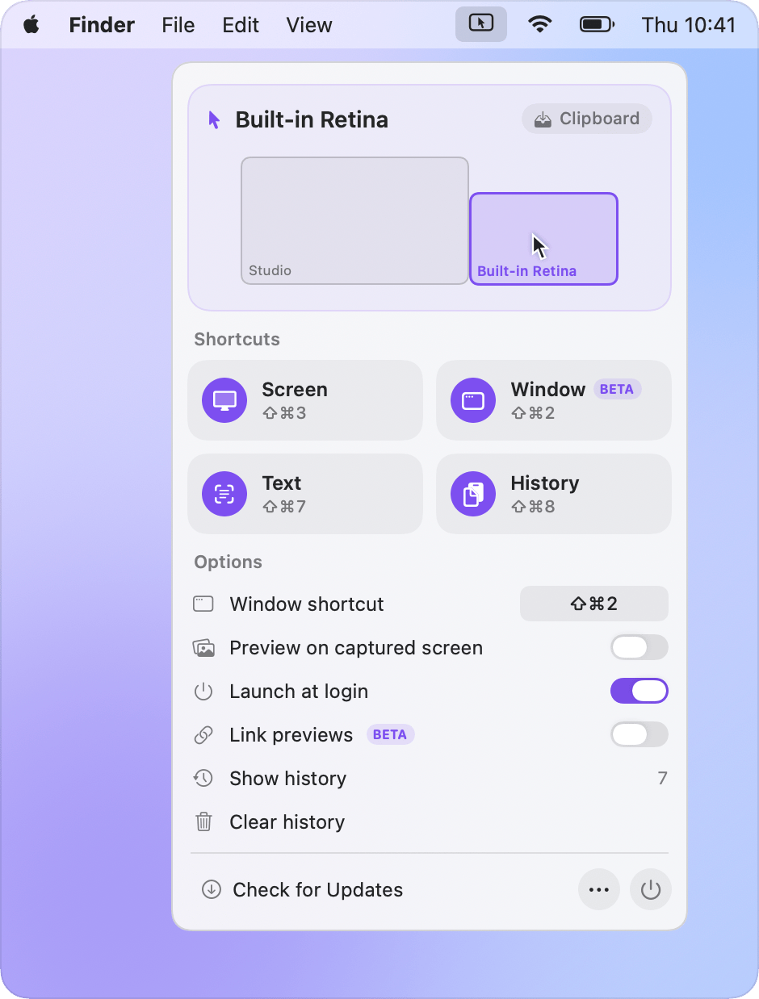
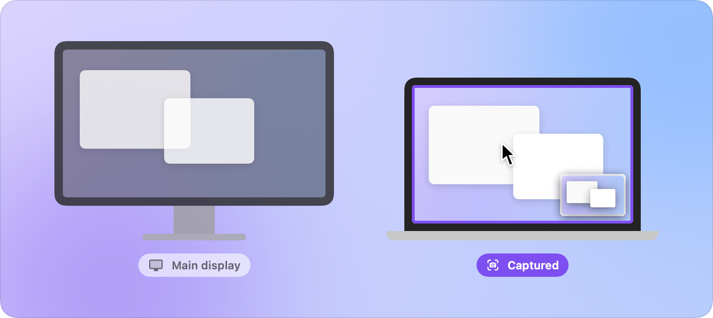
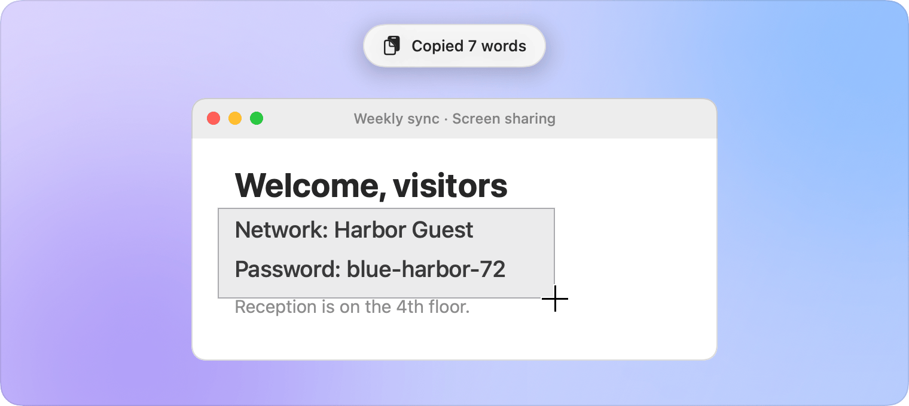
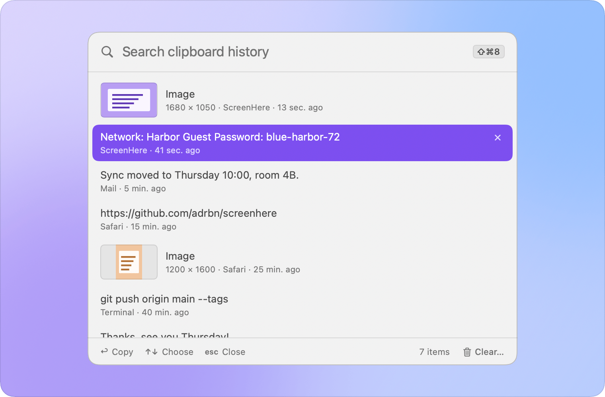

<picture>
  <source media="(prefers-color-scheme: dark)" srcset="docs/assets/icon-dark.png">
  
</picture>

# ScreenHere

### ⇧⌘3 captures the screen you're looking at.

On a Mac with more than one display, the screenshot shortcut finally takes the screen under your pointer. 
Plus two more: copy the text on your screen, and bring back what you copied earlier.

 

macOS 13 or later · Signed and notarized · Free and open source

 

<picture>
  <source media="(prefers-color-scheme: dark)" srcset="docs/assets/hero-dark.png">
  
</picture>

## The problem

With two displays, <kbd>⇧</kbd><kbd>⌘</kbd><kbd>3</kbd> captures both. If your screenshots go to the clipboard, macOS keeps only the main display, even when you were working on the other one. The workaround is <kbd>⇧</kbd><kbd>⌘</kbd><kbd>5</kbd> and a click on the right screen, every single time.

ScreenHere takes over the shortcut you already use and captures only the display your pointer is on. Your destination, file format and shutter sound stay exactly as macOS has them. There is nothing new to learn.

## Three shortcuts

### ⇧⌘3 · The screen under your pointer

<picture>
  <source media="(prefers-color-scheme: dark)" srcset="docs/assets/capture-dark.png">
  
</picture>

<kbd>⌃</kbd><kbd>⇧</kbd><kbd>⌘</kbd><kbd>3</kbd> sends it straight to the clipboard. Turn on **Preview on Captured Screen** and the thumbnail shows up on the screen you captured, not wherever macOS decides.

**Only the window?** Turn on **Window** in the menu (it's a beta), then press <kbd>⇧</kbd><kbd>⌘</kbd><kbd>2</kbd>: you get the window under your pointer instead of the whole screen, and <kbd>⌃</kbd><kbd>⇧</kbd><kbd>⌘</kbd><kbd>2</kbd> copies it. Rather use another shortcut? Click **⇧⌘2** next to **Window shortcut** and press yours.

### ⇧⌘7 · Copy the text on your screen

<picture>
  <source media="(prefers-color-scheme: dark)" srcset="docs/assets/text-dark.png">
  
</picture>

Drag over text you can see but can't select: a shared screen, a video, a photo, an error dialog. The text lands on your clipboard.

### ⇧⌘8 · Everything you copied, one shortcut away

<picture>
  <source media="(prefers-color-scheme: dark)" srcset="docs/assets/history-dark.png">
  
</picture>

The last 200 texts and images you copied, in a list under your pointer. Type to filter, press <kbd>Return</kbd>, paste. Off until you turn it on.

## Private by design

- **Text is read on your Mac** by Apple's Vision framework. Nothing is uploaded.
- **The history never leaves your Mac**, and only your account can read it. Anything a password manager marks as secret is never kept.
- **No account, no analytics.** ScreenHere only goes online to check for updates, and to fetch link titles if you turn on that beta.
- **Open source**, so you can check all of this yourself.

## Install

1. [Download ScreenHere](https://github.com/adrbn/screenhere/releases/latest/download/ScreenHere.dmg) and drag it to **Applications**.
2. Open it and allow **Screen Recording** when macOS asks, then reopen the app.
3. Say yes to **Launch at Login**, so the shortcut still works after a restart.

ScreenHere keeps itself up to date.

## FAQ

<b>Is it useful with a single display?</b>

 

Yes. <kbd>⇧</kbd><kbd>⌘</kbd><kbd>3</kbd> then works as it always has, and <kbd>⇧</kbd><kbd>⌘</kbd><kbd>7</kbd> and <kbd>⇧</kbd><kbd>⌘</kbd><kbd>8</kbd> work the same on any Mac.

<b>Does it replace the macOS screenshot tools?</b>

 

No. <kbd>⇧</kbd><kbd>⌘</kbd><kbd>4</kbd>, <kbd>⇧</kbd><kbd>⌘</kbd><kbd>5</kbd> and the Screenshot app are untouched, and ScreenHere follows the settings you choose there.

<b>How do I get the normal ⇧⌘3 back, or uninstall?</b>

 

Click **Restore macOS Shortcuts** in the menu, quit, and move the app to the Trash. ScreenHere also gives the shortcuts back when it quits, when your Mac shuts down, and on the next launch after a crash. If you deleted the app without restoring them, [one Terminal command](docs/HOW-IT-WORKS.md#without-the-app) does it.

<b>⇧⌘7 does nothing.</b>

 

Another app probably uses the same shortcut (TextSniper does, for example). Turn it off in that app, or turn off **Copy Text from Screen** in ScreenHere.

<b>macOS asks whether ScreenHere may read the clipboard.</b>

 

Since macOS 15.4, apps have to ask before reading the clipboard in the background. Choose **Always Allow** so the history can keep what you copy.

<b>Can I hide the menu-bar icon?</b>

 

Yes, with **Hide Menu Bar Icon**. The shortcuts keep working. Open ScreenHere again from Applications to bring the icon back.

## More

- [How it works](docs/HOW-IT-WORKS.md): borrowing the shortcut and giving it back, window capture, the capture preview, text recognition, the clipboard history and link previews.
- [Building from source](docs/BUILDING.md)
- [Report a bug or ask for a feature](https://github.com/adrbn/screenhere/issues)

## License

[MIT](LICENSE)
