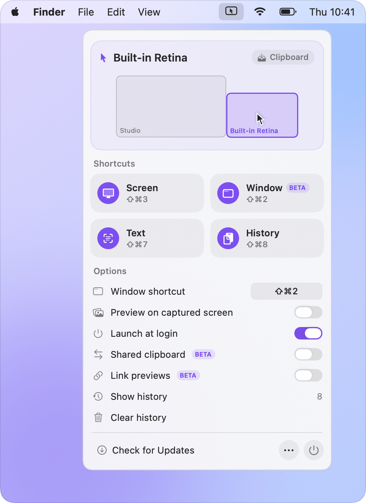
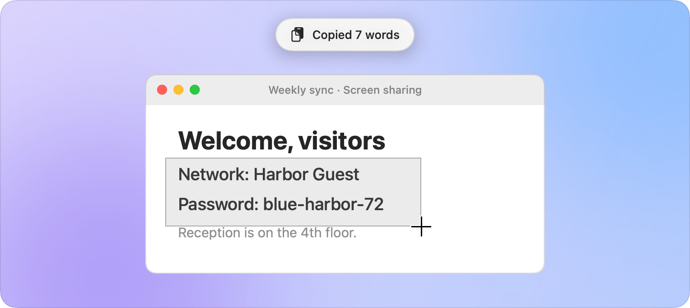
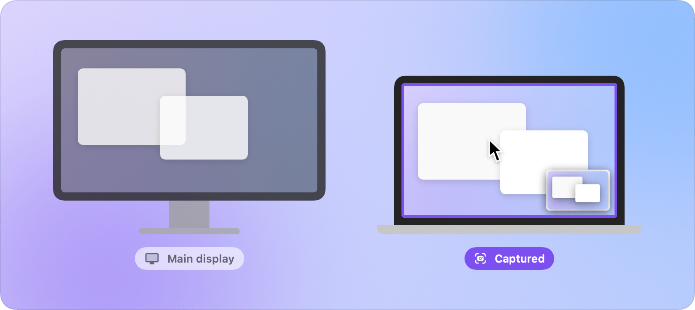
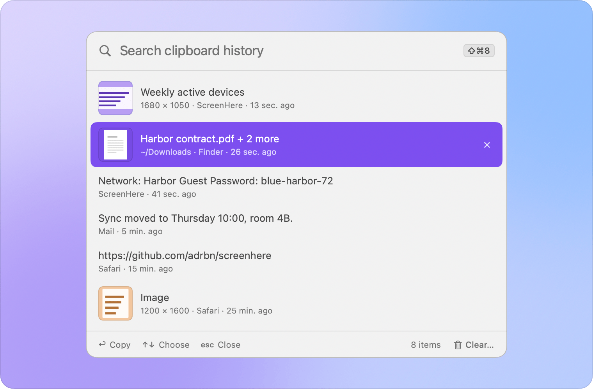

<picture>
  <source media="(prefers-color-scheme: dark)" srcset="docs/assets/icon-dark.png">
  
</picture>

# ScreenHere

### The three screen shortcuts your Mac and your PC are missing.

<kbd>⇧</kbd><kbd>⌘</kbd><kbd>7</kbd> copies any text you can see but can't select. 
<kbd>⇧</kbd><kbd>⌘</kbd><kbd>3</kbd> captures the screen under your pointer, not both of them. 
<kbd>⇧</kbd><kbd>⌘</kbd><kbd>8</kbd> brings back anything you copied earlier.

 

macOS 13 or later · Signed and notarized · Free and open source

**[Download for Windows](https://github.com/adrbn/screenhere/releases/latest/download/ScreenHere-Windows.exe)** · Windows 10 and 11 · the same shortcuts with <kbd>Win</kbd> for <kbd>⌘</kbd> · <a href="windows/README.md">what differs</a>

 

<picture>
  <source media="(prefers-color-scheme: dark)" srcset="docs/assets/hero-dark.png">
  
</picture>

## The problem

Text on your screen is often text you can't select — a shared screen in a call, a paused video, a photo of a page, an error dialog that won't even let you copy its own message. So you retype it by hand.

And with two displays, <kbd>⇧</kbd><kbd>⌘</kbd><kbd>3</kbd> captures both. If your screenshots go to the clipboard, macOS keeps only the main display, even when you were working on the other one. The workaround is <kbd>⇧</kbd><kbd>⌘</kbd><kbd>5</kbd> and a click on the right screen, every single time.

ScreenHere takes over the shortcuts you already use: <kbd>⇧</kbd><kbd>⌘</kbd><kbd>7</kbd> turns anything on screen into text on your clipboard, and <kbd>⇧</kbd><kbd>⌘</kbd><kbd>3</kbd> captures only the display your pointer is on. Your destination, file format and shutter sound stay exactly as macOS has them. There is nothing new to learn.

## Three shortcuts

### ⇧⌘7 · Copy the text on your screen

<picture>
  <source media="(prefers-color-scheme: dark)" srcset="docs/assets/text-dark.png">
  
</picture>

Drag over it and it's yours: a Wi-Fi password on someone's shared screen, a slide in a call, a serial number in a photo, a paragraph in a screenshot a colleague sent you. The text lands on your clipboard, ready to paste.

It reads on your Mac, with Apple's own text recognition — nothing is uploaded, and it works with no network at all. Press the shortcut again on the same spot and you get the same text, in any of the languages macOS recognises.

### ⇧⌘3 · The screen under your pointer

<picture>
  <source media="(prefers-color-scheme: dark)" srcset="docs/assets/capture-dark.png">
  
</picture>

<kbd>⌃</kbd><kbd>⇧</kbd><kbd>⌘</kbd><kbd>3</kbd> sends it straight to the clipboard. Turn on **Preview on captured screen** and the thumbnail shows up on the screen you captured, not wherever macOS decides.

**Only the window?** Turn on **Window** in the menu (it's a beta), then press <kbd>⇧</kbd><kbd>⌘</kbd><kbd>2</kbd>: you get the window under your pointer instead of the whole screen, and <kbd>⌃</kbd><kbd>⇧</kbd><kbd>⌘</kbd><kbd>2</kbd> copies it. Rather use another shortcut? Click **⇧⌘2** next to **Window shortcut** and press yours.

### ⇧⌘8 · Everything you copied, one shortcut away

<picture>
  <source media="(prefers-color-scheme: dark)" srcset="docs/assets/history-dark.png">
  
</picture>

The last 200 things you copied — text, images, files — in a list under your pointer. Type to filter, press <kbd>Return</kbd>, paste. Copied files are listed by name with a Quick Look preview, and <kbd>Return</kbd> puts them back on the clipboard for the Finder; a file moved since is greyed out rather than forgotten. A picture can also be dragged out into any app, or saved to your Downloads folder. Off until you turn it on.

**Two computers?** Turn on **Shared clipboard** (a beta) on both, connect them once with a code, and what you copy on one is on the clipboard of the other — a Mac and a PC included. It stays on your network: [how it works](docs/SHARED-CLIPBOARD.md).

## On Windows

<picture>
  <source media="(prefers-color-scheme: dark)" srcset="docs/assets/windows-panel-dark.png">
  
</picture>

The same app, on Windows 10 and 11: <kbd>Win</kbd><kbd>Shift</kbd><kbd>3</kbd> for the screen under the pointer, <kbd>Win</kbd><kbd>Shift</kbd><kbd>2</kbd> for the window, <kbd>Win</kbd><kbd>Shift</kbd><kbd>7</kbd> for text and <kbd>Win</kbd><kbd>Shift</kbd><kbd>8</kbd> for the history, behind the same panel. Text is read by Windows' own recogniser, on your PC.

Every shortcut can be changed there, and ScreenHere stays out of the way of PowerToys. No administrator rights are needed, to install it or for anything it does. [ScreenHere for Windows](windows/README.md) has the details.

## Private by design

- **Text is read on your computer**, by Apple's Vision framework on a Mac and by Windows' own recogniser on a PC. Nothing is uploaded.
- **The history never leaves your computer**, and only your account can read it. Anything a password manager marks as secret is never kept.
- **No account, no analytics.** ScreenHere only goes online to check for updates, and to fetch link titles if you turn on that beta. The shared clipboard, if you turn it on, talks to your other device directly and encrypted, and never leaves your network.
- **Open source**, so you can check all of this yourself.

## Install

1. [Download ScreenHere](https://github.com/adrbn/screenhere/releases/latest/download/ScreenHere.dmg) and drag it to **Applications**.
2. Open it and allow **Screen Recording** when macOS asks, then reopen the app.
3. Keep **Launch ScreenHere at login** ticked, so the shortcut still works after a restart.

ScreenHere keeps itself up to date.

**On Windows**, download [ScreenHere-Windows.exe](https://github.com/adrbn/screenhere/releases/latest/download/ScreenHere-Windows.exe) and open it: it moves into your own Programs folder and sits in the notification area. Nothing to allow, and no administrator needed.

## FAQ

<b>Is it useful with a single display?</b>

 

Yes. <kbd>⇧</kbd><kbd>⌘</kbd><kbd>3</kbd> then works as it always has, and <kbd>⇧</kbd><kbd>⌘</kbd><kbd>7</kbd> and <kbd>⇧</kbd><kbd>⌘</kbd><kbd>8</kbd> work the same on any Mac.

<b>Does it replace the macOS screenshot tools?</b>

 

No. <kbd>⇧</kbd><kbd>⌘</kbd><kbd>4</kbd>, <kbd>⇧</kbd><kbd>⌘</kbd><kbd>5</kbd> and the Screenshot app are untouched, and ScreenHere follows the settings you choose there.

<b>How do I get the normal ⇧⌘3 back, or uninstall?</b>

 

In the menu, click **⋯** then **Restore macOS Shortcuts**, quit, and move the app to the Trash. ScreenHere also gives the shortcuts back when it quits, when your Mac shuts down, and on the next launch after a crash. If you deleted the app without restoring them, [one Terminal command](docs/HOW-IT-WORKS.md#without-the-app) does it.

<b>⇧⌘7 does nothing.</b>

 

Another app probably uses the same shortcut (TextSniper does, for example). Turn it off in that app, or turn off **Text** in ScreenHere's menu.

<b>macOS asks whether ScreenHere may read the clipboard.</b>

 

Since macOS 15.4, apps have to ask before reading the clipboard in the background. Choose **Always Allow** so the history can keep what you copy.

<b>Can I hide the menu-bar icon?</b>

 

Yes: click **⋯** in the menu, then **Hide Menu Bar Icon**. The shortcuts keep working. Open ScreenHere again from Applications to bring the icon back.

## More

- [How it works](docs/HOW-IT-WORKS.md): borrowing the shortcut and giving it back, window capture, the capture preview, text recognition, the clipboard history and link previews.
- [The shared clipboard (beta)](docs/SHARED-CLIPBOARD.md): one clipboard for a Mac and a PC on the same network, how to connect them, and what it does on your network.
- [ScreenHere for Windows](windows/README.md): the same shortcuts on Windows 10 and 11, and what differs.
- [Building from source](docs/BUILDING.md)
- [Report a bug or ask for a feature](https://github.com/adrbn/screenhere/issues)

## License

[MIT](LICENSE)
