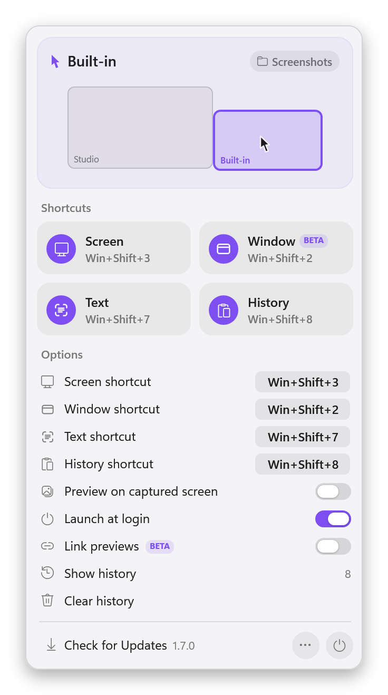
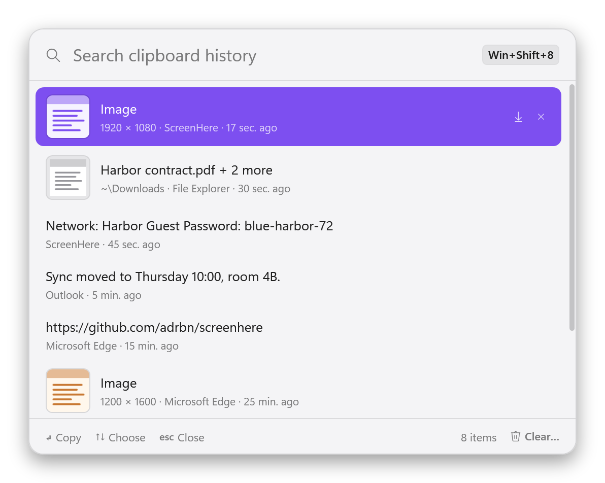

# ScreenHere for Windows

The same three shortcuts as on the Mac, on Windows 10 and 11.

<kbd>Win</kbd><kbd>Shift</kbd><kbd>7</kbd> copies any text you can see but can't select.<br/>
<kbd>Win</kbd><kbd>Shift</kbd><kbd>3</kbd> captures the screen under your pointer, not all of them side by side.<br/>
<kbd>Win</kbd><kbd>Shift</kbd><kbd>8</kbd> brings back anything you copied earlier.

<picture>
  <source media="(prefers-color-scheme: dark)" srcset="../docs/assets/windows-panel-dark.png">
  
</picture>

## Install

1. Download **ScreenHere-Windows.exe** from the [latest release](https://github.com/adrbn/screenhere/releases/latest) and open it.
2. That's all. ScreenHere moves into your own Programs folder, adds itself to the Start menu, and sits in the notification area. Click its icon for the panel.

No administrator rights, no account, nothing outside your user profile. ScreenHere keeps itself up to date.

> The build is not code-signed yet, so the first time you open the download Windows SmartScreen may ask: **More info**, then **Run anyway**.

## What it does

| | Shortcut | |
|---|---|---|
| **Screen** | <kbd>Win</kbd><kbd>Shift</kbd><kbd>3</kbd> | Captures only the display the pointer is on, into your Screenshots folder. Add <kbd>Ctrl</kbd> to send it to the clipboard instead. |
| **Window** (beta) | <kbd>Win</kbd><kbd>Shift</kbd><kbd>2</kbd> | Captures only the window under the pointer — whole, even when another window covers part of it. Off until you turn it on. |
| **Text** | <kbd>Win</kbd><kbd>Shift</kbd><kbd>7</kbd> | Drag over anything on screen and its text is on your clipboard. Read on your PC by Windows' own recogniser: nothing is uploaded, no network needed. |
| **History** | <kbd>Win</kbd><kbd>Shift</kbd><kbd>8</kbd> | The last 200 things you copied — text, images, files — in a list under your pointer. Type to filter, <kbd>Enter</kbd>, paste. Pictures are read on your PC, so a screenshot is listed by the words it shows and found by typing them. Off until you turn it on. |

<picture>
  <source media="(prefers-color-scheme: dark)" srcset="../docs/assets/windows-history-dark.png">
  
</picture>

The panel is the same as the Mac's: the map of your displays with the one under the pointer filled in, a tile that switches each feature on and off, and the options of whatever is on — **Preview on captured screen**, **Launch at login**, **Shared clipboard** (beta), **Link previews** (beta).

**Shared clipboard** gives this PC and a Mac — or another PC — one clipboard, on the same network and nowhere else: [how to connect them, and what it does](../docs/SHARED-CLIPBOARD.md).

## What is different from the Mac

- **Every shortcut can be changed.** Click it in the options and press the keys you want; <kbd>Esc</kbd> keeps the one you had, the arrow goes back to the default. Keyboards differ more on Windows, and so do the shortcuts other apps got to first. Keys another of ScreenHere's features already has are taken from it, and the two swap.
- **The clipboard key is the other of Win and Ctrl.** With <kbd>Win</kbd><kbd>Shift</kbd><kbd>3</kbd>, adding <kbd>Ctrl</kbd> sends the capture to the clipboard. If your keyboard has the two swapped to put Ctrl under your thumb, Mac style, record <kbd>Ctrl</kbd><kbd>Shift</kbd><kbd>3</kbd> and it is <kbd>Win</kbd> that sends to the clipboard: the same fingers as <kbd>⌃</kbd><kbd>⇧</kbd><kbd>⌘</kbd><kbd>3</kbd>.
- **The destination is ScreenHere's to set.** Windows has no setting for where screenshots go, so the chip at the top of the panel switches between your Screenshots folder and the clipboard.
- **Captures are in the history either way.** A capture saved to the Screenshots folder is listed in the clipboard history like one sent to the clipboard, so <kbd>Win</kbd><kbd>Shift</kbd><kbd>8</kbd> finds it.
- **The preview is on by default.** On the Mac it has to switch off macOS's own preview; on Windows there is nothing to switch off, and no shutter sound to say a capture worked. It also shows for <kbd>Win</kbd><kbd>PrtScn</kbd> and for snips the Snipping Tool saves.
- **Nothing to restore.** See below.

## How it works

**Taking the shortcuts over.** Windows keeps <kbd>Win</kbd><kbd>Shift</kbd><kbd>digit</kbd> for the taskbar and refuses to register it for anyone else. So ScreenHere watches the keyboard (a low-level keyboard hook, on a thread that does nothing else) and keeps the combinations it was given: they never reach the taskbar or the app in front. It looks at nothing but those combinations, and records nothing. Nothing is written to Windows' settings either, so there is no shortcut to give back: quit ScreenHere and they are Windows' again at once. Keys typed by other tools count too, so a macro pad or a remapper can press them.

**Living with PowerToys.** ScreenHere sees the keyboard before PowerToys does, and could win every shortcut; it is built not to. It reads the keys as they are after Keyboard Manager's remaps, so a remapped keyboard behaves the way you set it up. A shortcut PowerToys already has — a module's, or one of Keyboard Manager's — is refused by the recorder (**Used by PowerToys**). And should one of ScreenHere's turn out to be PowerToys' as well, ScreenHere leaves it to PowerToys and the tile says so, until you pick another.

One limit: Windows does not show an app the keys typed into a window running as administrator, so the shortcuts do nothing while such a window is in front.

**Capturing.** On each press ScreenHere reads the pointer's position, finds the display that contains it, and copies that display's pixels, at their real size whatever the scaling. A window is asked to draw itself (`PrintWindow`), so it comes out whole even when partly covered; the desktop, the taskbar and menus are no window, and give the display instead.

**Reading text.** The selection is ScreenHere's own crosshair: it never takes the keyboard, so the menu or the tooltip you are reading stays open under it. The text is read by `Windows.Media.Ocr`, in the languages installed in Windows (Settings › Time & language › Language & region: a language's *Optical character recognition* feature). Small interface text is enlarged first, which the recogniser needs.

**The clipboard history** is told about each copy by Windows (`AddClipboardFormatListener`); nothing is polled. It stays in `%APPDATA%\ScreenHere`, readable by your account only. Copies that password managers mark as private — `ExcludeClipboardContentFromMonitorProcessing`, `CanIncludeInClipboardHistory` — are never recorded. Pictures are kept as files, up to 100 MB; copied files are kept as their addresses.

**Link previews** follow the same rules as on the Mac: a link is visited when the list shows it, never when you copy it, without cookies, over https only, the top megabyte at most, never on a metered connection, and never when it looks private or single-use. The name is looked up by ScreenHere itself and the visit goes to the address that was checked.

**From a script.** A second launch can press a shortcut for the one that is running: `ScreenHere.exe --do screen`, `window`, `text` or `history`.

## Uninstall

1. Turn off **Launch at login** in the panel, then quit ScreenHere (the power button).
2. Delete the folder `%LOCALAPPDATA%\Programs\ScreenHere` and the **ScreenHere** shortcut in the Start menu.
3. To remove the settings and the history as well, delete `%APPDATA%\ScreenHere`.

## Building from source

It needs the [.NET 8 SDK](https://dotnet.microsoft.com/download/dotnet/8.0), on Windows.

```powershell
dotnet test windows\ScreenHere.Tests          # the tests
dotnet run --project windows\ScreenHere       # run it from the build folder
.\windows\scripts\publish.ps1                 # one file: windows\dist\ScreenHere-Windows.exe
.\windows\scripts\readme-shots.ps1            # redraw this page's pictures, from posed data
```

To try a build without touching an installed copy, give it a profile of its own: with `SCREENHERE_PROFILE` set to a folder, its settings, history and captures all go there, it does not register itself at login, and it runs beside the installed one.

Releases: publishing a GitHub release builds `ScreenHere-Windows.exe` and attaches it (`.github/workflows/windows.yml`). The app only offers an update for releases that carry that file, so a release that only concerns the Mac goes unnoticed on Windows.

The app is C# and WPF, a single process. `Hotkeys.cs` is the keyboard hook, `Capture.cs` the pixels, `TextCapture.cs` the selection and the recogniser, `ClipboardController.cs` and `ClipboardHistory.cs` the history, `Links.cs` the link previews, `PanelWindow.cs` and `HistoryWindow.cs` the two windows, `Theme.cs` the colours and the shapes they are built from.
